# CollegeApp
### Summary
Android application to assist people in evaluating postsecondary schools. This application enables users to find information about schools, track their own experiences at schools, and find schools that are nearby. 

### Screenshots

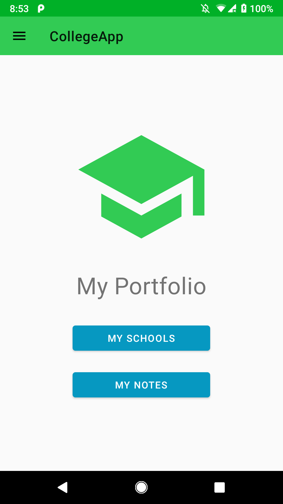 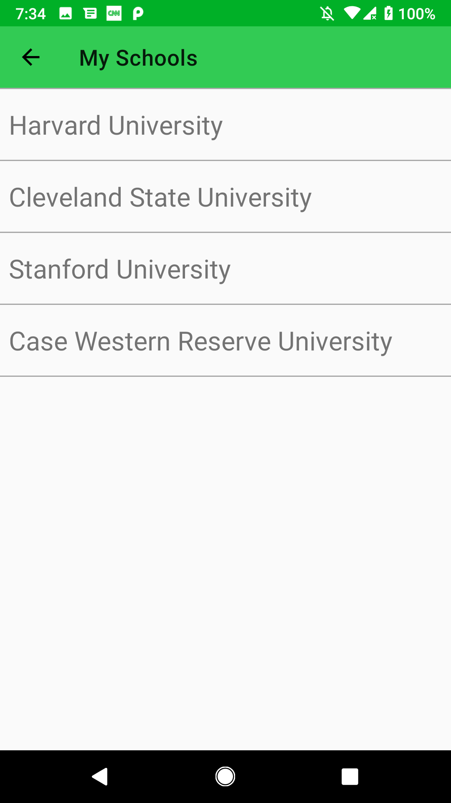 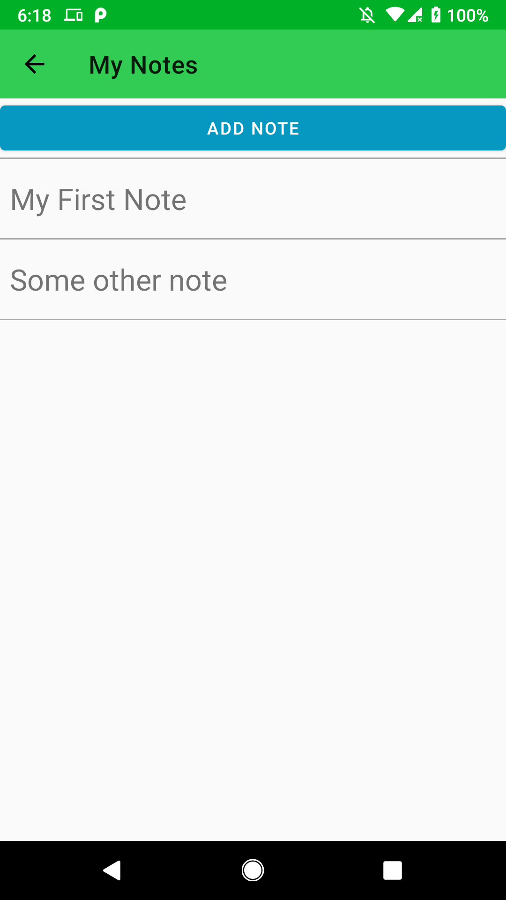  

Your portfolio and navigation

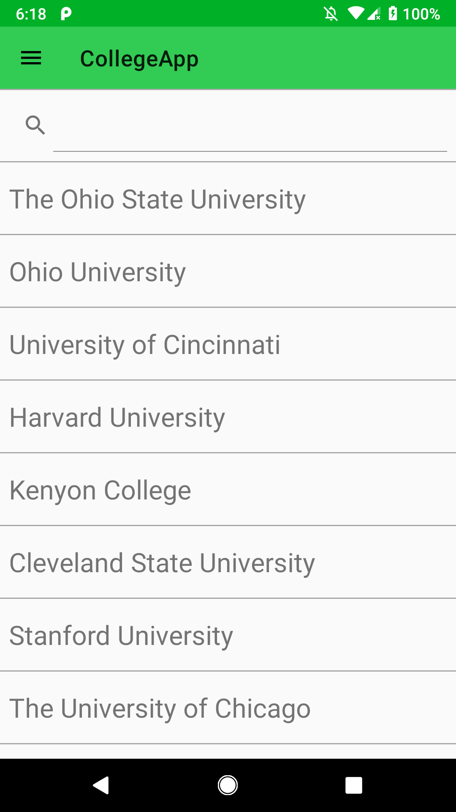 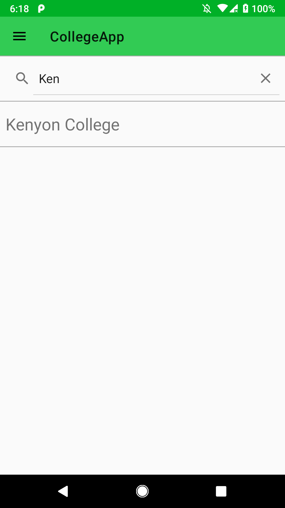  

Searching for and viewing schools

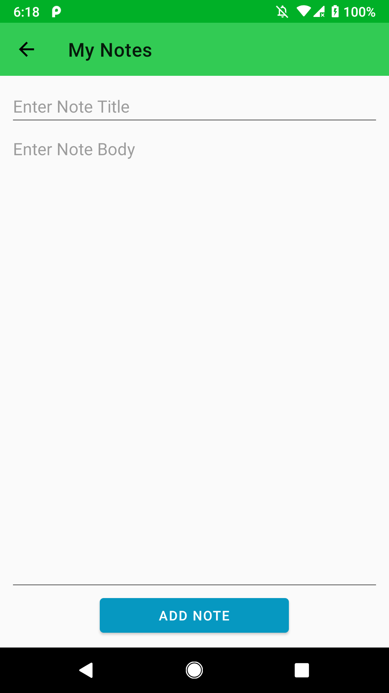 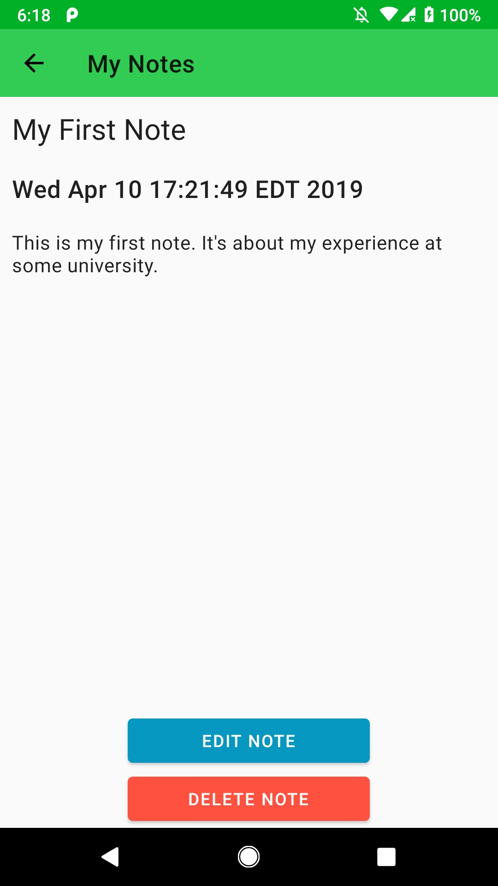

Taking notes

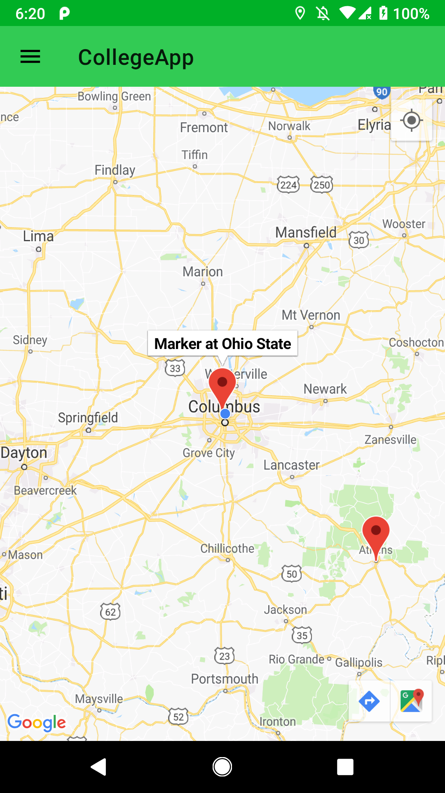

Viewing nearby schools

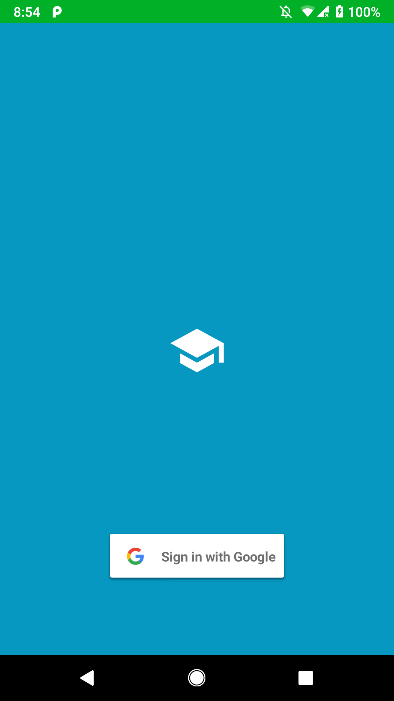 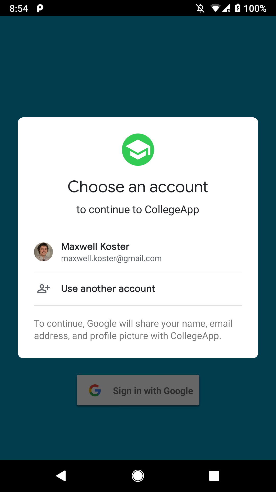 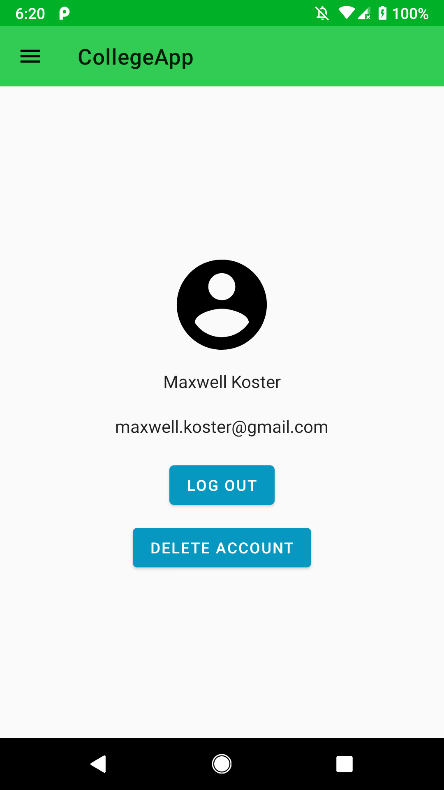

Account management via Google Sign-in
